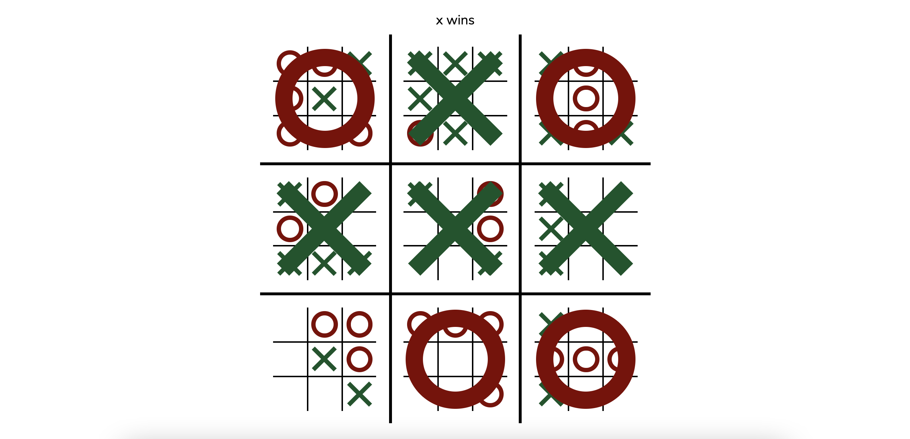

# [Ultimate Tic Tac Toe](https://ronikbhaskar.github.io/ultimate_tic_tac_toe/)
https://u3t.netlify.app/ is deprecated, but I like the URL, so it'll keep working.

## Rules

#### **`x` goes first:**

 - On the first move, `x` can play anywhere on the board.

#### **`o` goes second:**

 - `o` can only play in the section of the global board that corresponds to where `x` played in the local board.
   - ex. If `x` plays in the center of the top left board, then `o` can play anywhere in the center board.

#### **the game repeats:**

 - Now `x` is restricted to the section that corresponds to `o`'s last move.
 - If the corresponding section has been won (more on that later), or it is full, the player can play anywhere.

#### **until someone wins:**

 - If you get 3 in a row in a local board, you win that board.
 - If the local board is a draw, no one gets it.
 - Three local boards in a row, and you win the game.
 - If the game finishes without anyone getting 3 local boards in a row, it's a draw.

### Best of Luck!

